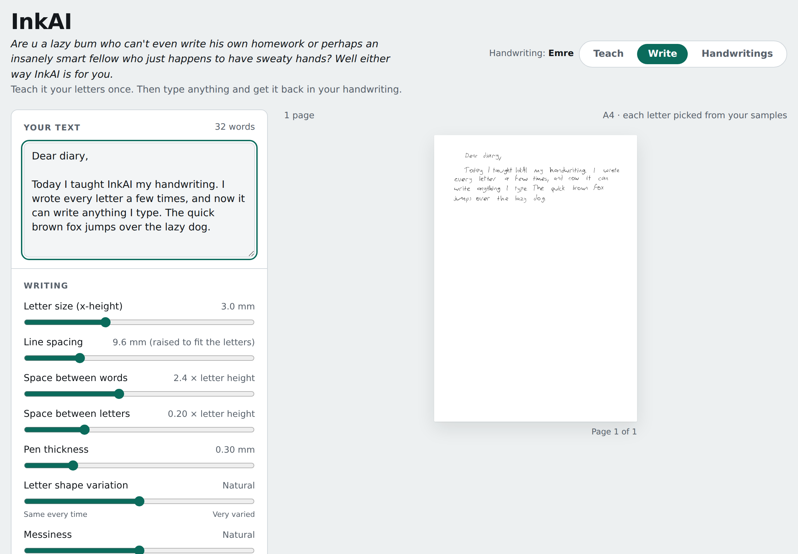
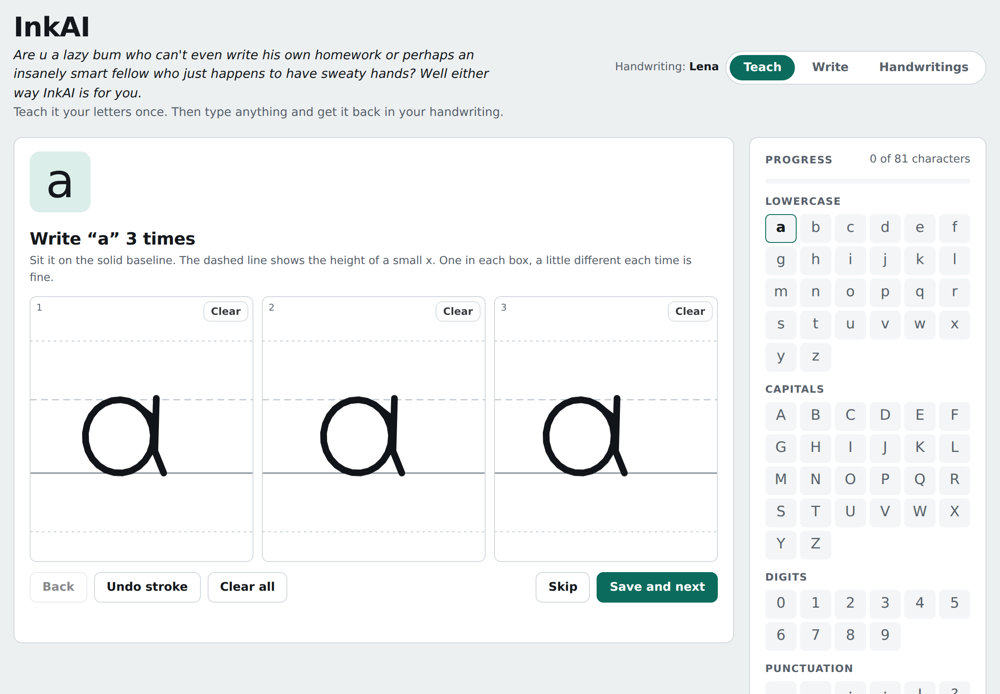

<p align="center"></p>

<h1 align="center">InkAI</h1>

<p align="center"><em>Are u a lazy bum who can't even write his own homework or perhaps an insanely smart fellow who just happens to have sweaty hands? Well either way InkAI is for you.</em></p>

<p align="center">Type anything and InkAI writes it out in your own handwriting, as a PDF or an image.</p>

---



## What it does

- **Learns your handwriting.** You write each letter 1–10 times on guide lines, plus one short sentence so it learns your spacing. You can add more samples any time.
- **Writes anything you type.** Paste text and it's drawn letter by letter from your own samples.
- **Never looks copy-pasted.** Every letter is picked from your samples at random and slightly reshaped each time. Words lean and press a little differently, lines wander, the last word gets squeezed in at the end of a line, and the writing gets a touch looser over long texts, like a real tired hand.
- **Joined-up writing.** A "Join letters" switch connects the letters inside each word for people whose handwriting is joined.
- **Lots of settings.** Letter size, line spacing, word and letter spacing, pen thickness, shape variation and messiness.
- **Paper and ink.** Blank, lined or squared 5 mm paper, in black, royal blue or pencil.
- **Export.** Vector PDF, PNG (optionally transparent), or copy the page straight into OneNote, GoodNotes or Notes.
- **Several people.** Each person gets their own handwriting, and you can save it as a file to back it up or move it to another device.
- **German and Turkish.** Includes ä ö ü ß „ and ç ğ ı ş İ.
- **Private.** Everything stays on your device. There's no account and no server.



## Use it on an iPad (or any phone)

1. Open the InkAI link in **Safari**.
2. Tap **Share** → **Add to Home Screen** → **Add**.
3. Open InkAI from your home screen. It runs full screen like a normal app and works offline after the first visit.

An Apple Pencil gives the best results when teaching letters. Once you've used the Pencil, touches from your palm are ignored.

## How to teach it

1. **Teach**: write each character in the boxes, on the dark line. The dashed line is the height of a small x, and tails of g, j, p, q and y hang below. The faint letter in each box only shows the size. Don't trace it; write the way you normally do.
2. Write the spacing sentence at the end, the way you normally would.
3. **Write**: type or paste your text, adjust the look, and save it as a PDF or PNG.
4. **Handwritings** → **Save file** makes a backup of your handwriting. Load it on another device the same way.

Your handwriting is saved on your device automatically, so it's still there next time. Saving a backup file is still a good idea, because clearing your browser data deletes it.

## How it works

InkAI doesn't need a cloud AI. It learns from your own samples:

1. Every letter you write is stored as pen strokes, measured against the guide lines, so size and baseline are consistent.
2. When writing, each character picks one of your samples at random, avoiding the one it used last time.
3. Each copy is reshaped a little (stretch, slant and a gentle wave) and placed with natural jitter in size, height, rotation, letter gaps and word gaps. Each line gets its own slight slope.
4. The page is drawn as vectors, so PDFs stay sharp at any zoom.

It works best for print handwriting, where letters aren't joined.

## Run it yourself

It's a single HTML file with no build step:

```
python3 -m http.server
```

Then open `http://localhost:8000`. To publish your own copy, fork the repo and turn on **Settings → Pages → Deploy from branch → main / root**.

## Files

| File | What it is |
| --- | --- |
| `index.html` | The whole app |
| `manifest.webmanifest` | Lets it be added to the home screen as an app |
| `sw.js` | Makes it work offline |
| `icon-*.png`, `apple-touch-icon.png` | App icons |

## Credits

Made by **Emre** ([@LoadingTheDev1](https://github.com/LoadingTheDev1)).

## Special thanks

- Ata Demirdirek
- Doruk Ege Tekeoğlu
- Ataberk Cesur

## License

MIT. See [LICENSE](LICENSE).
